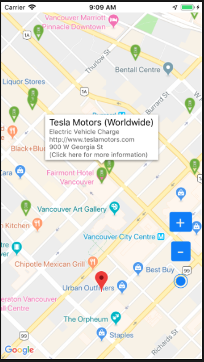
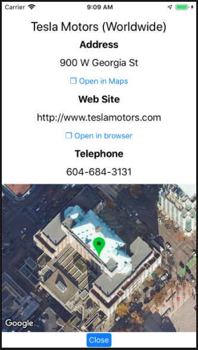

# ios-googlemaps-view
Electric Vehicle Charger Location Viewer using Google Maps 

## Features

* Full screen Google Maps view
* Detects current location
* Detects current place
* Controls: Zoom In / Zoom out / Current location
* Shows markers for nearer EV charge stations
* Gets location info
* Link to Map navigation
* Link to website

## Components used

* Google Maps SDK for iOS (https://developers.google.com/maps/documentation/ios-sdk/current-place-tutorial)
  * Google Maps View (`GMSMapView`)
  * Google Maps Marker (`GMSMarker`)
  * Google Places Client (`GMSPlacesClient`)
  * iOS Location API (`CLLocationManager`, `CLLocation`)
  
  ## Screenshots
  

## Usage

* Download or clone the project 
* Install cocoa pods if not installed (See https://cocoapods.org/)
  *  `sudo gem install cocoapods`
* Execute in a command line
  * `pod install`
* Open the application project from the `.xcworkspace` file
  * `open ios-googlemaps-view.xcworkspace`
